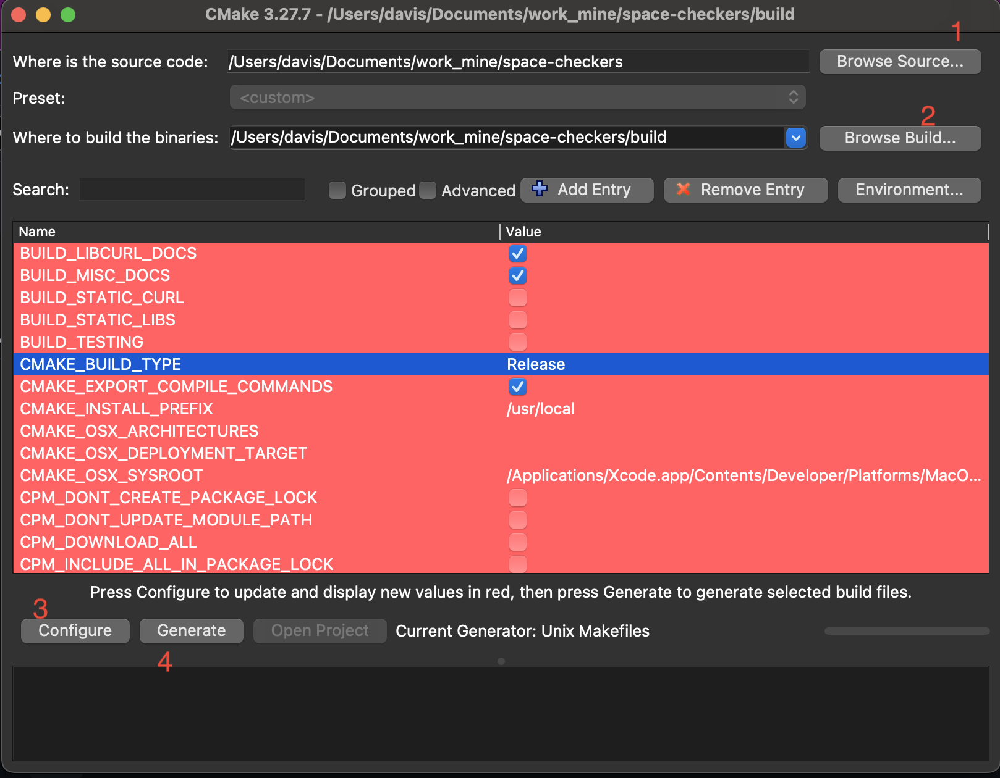

# Building Locally (Release mode)

## On Windows

1. Just import this project directly in Visual Studio 2022 (or newer), with native CMake extension installed.
2. Wait as Visual Studio auto-configures this project for you.
3. Next, from top toolbar, change mode to **'Release'**, and click **Build** > **Build All**.
4. Done. That's it! Your game `.exe` will be inside `{PROJECT_DIR}/out/Release/bin/`. Enjoy!

## On MacOS & Linux (using Terminal)

1. Ensure CMake 3.20 or higher is installed. Verify with `cmake --version`
2. Open this project directory in your Terminal.
3. Next, copy and run the following commands:

```bash
mkdir out/
cd out/
cmake . . -DCMAKE_BUILD_TYPE=Release
cmake --build . --config Release -j

```

4. Done. Your optimized game executable (`.app` on MacOS) will be found inside `{PROJECT_DIR}/out/bin/`
5. Alternatively, if you have CLion IDE, you can skip ALL steps above, and use it to build in "Release" mode.

## Using CMake GUI (all desktop platforms)

- Download latest stable [CMake GUI installer](https://cmake.org/download/) from official site
- Open CMake GUI, refer to the screenshot below:
  

- Set "Source Folder" (1) to this project root dir. Then, set "Build Folder" (2) to a NEW _relative_ folder `/build` or `/out`.
- Ensure "CMAKE_BUILD_TYPE" is **Release** (see image above, blue highlight). Ignore other settings. Then (3) click **Configure**.
- In the popup window, choose generator **'Unix Makefiles'** if on Linux; choose **'XCode'** if on MacOS. Choose **'Visual Studio'** if on Windows. Then click OK to save.
- Click **Configure** once again, then click (4) **Generate**.
- Finally, on Windows or MacOS, click **Open Project** for building in respective IDE. On Linux desktop, open build folder, then run `make -j` in Terminal.

### Important:

For macOS-specific guide with XCode, please see [cmake/README.md](cmake/README.md)
