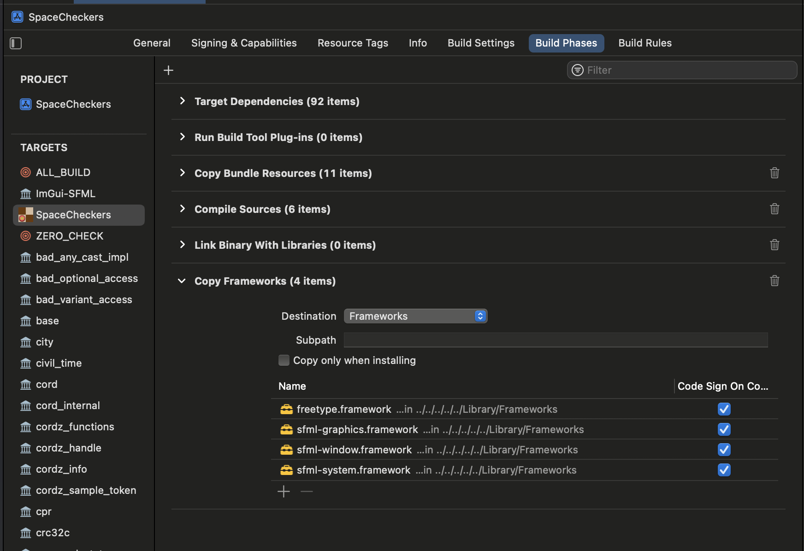

## What's 'macbundle.cmake' for?

This contains CMake script to build MacOS GUI `.app` bundle. It embeds the icon to the app bundle. It also copies all static assets (resources) into the bundle at build time.

**IMPORTANT**: If you installed SFML as "Frameworks" (recommended), you will need to manually instruct XCode to embed them into the bundle at Build time. Otherwise, the game won't work on other similar Macs!

Kindly follow these steps:

- Use CMake to generate "XCode Project". Refer to [BUILDING.md](../BUILDING.md). Open the project.
- From top toolbar inside Xcode, click **Product** > **Add New Build Phase** > choose **Copy Files**. See official [Apple guide](https://developer.apple.com/documentation/xcode/customizing-the-build-phases-of-a-target)
- Expand the "Copy Files" section, select destination: **Frameworks**.
- Click the `+` (add button) to begin. A new window will pop up.
- Now select all SFML frameworks listed: `sfml-graphics.framework`, `sflml-window.framework` etc.
- Lastly, you will need to add `freetype.framework` (for text support). Click **"Add Other..."**, find it inside `/Library/Frameworks`. Click "Copy as reference folder". Click OK.
- You should have output similar to screenshot below (I renamed "Copy Files" to "Copy Frameworks"):
  
- Now you can build your project. From top toolbar, Click **Product** > **Build**. Done!
